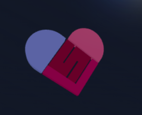
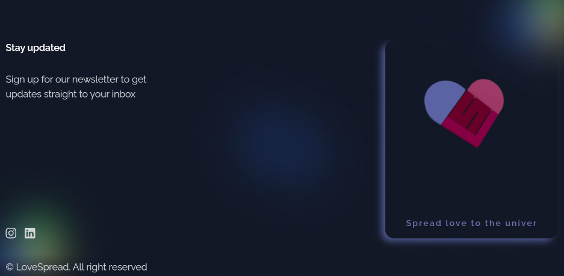

  
# Love Spread

**Definition:**  
Love Spread is a philanthropic social media platform designed to bring people together from around the world to support worthy causes.  

**About:**  
Love Spread allowed users to pool donations for initiatives such as rescuing dogs, providing clean water, advancing education, and assisting communities recovering from disasters. By making collaboration easy, it enabled communities to come together and create a tangible, positive impact.  





## Tools

- TailwindCSS v3.3  
- AstroJS v3  

## 🚀 Project Structure

Inside your Astro project, you'll find the following folders and files:  

```text
/
├── public/
│   ├── images/
│   ├── logos/*
│   └── favicon.svg
├── src/
│   ├── components/
│   │   ├── blocks/*
│   │   ├── cards/*
│   │   ├── elements/*
│   │   ├── sections/*
│   │   └── shared/*
│   ├── layouts/
│   │   └── Layout.astro
│   └── pages/
│       └── index.astro
├── package.json
└── tailwind.config.cjs
```


## 🧞 Commands

All commands are run from the root of the project, via the terminal:  

| Command                | Action                                           |
| :--------------------- | :----------------------------------------------- |
| `npm install`          | Install project dependencies                     |
| `npm run dev`          | Start local dev server at `localhost:4321`      |
| `npm run build`        | Build your production site to `./dist/`         |
| `npm run preview`      | Preview your build locally before deploying     |
| `npm run astro ...`    | Run CLI commands such as `astro add`, `astro check` |
| `npm run astro --help` | Display help for Astro CLI commands             |
